# De la cámara oscura a la imagen intencional

**Óptica, composición y postproceso en fotografía digital**  
TP6 — 006_fotografia_digital  
Procesamiento Digital de Imágenes  
Mayo 2026

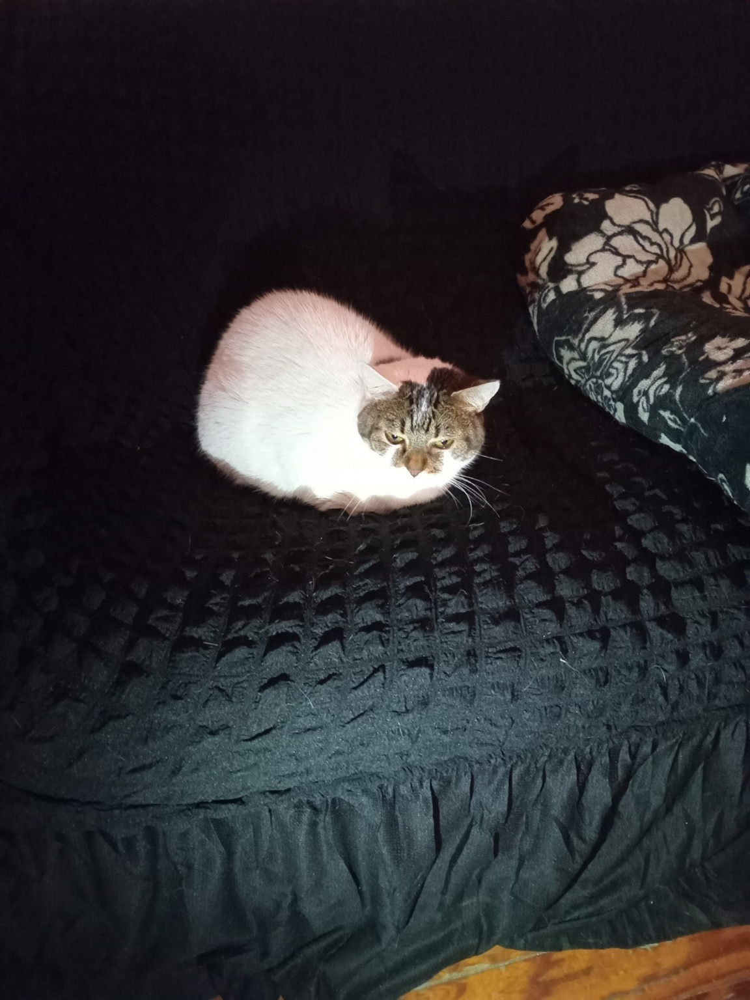

---

## 1. Cámara oscura: principio óptico

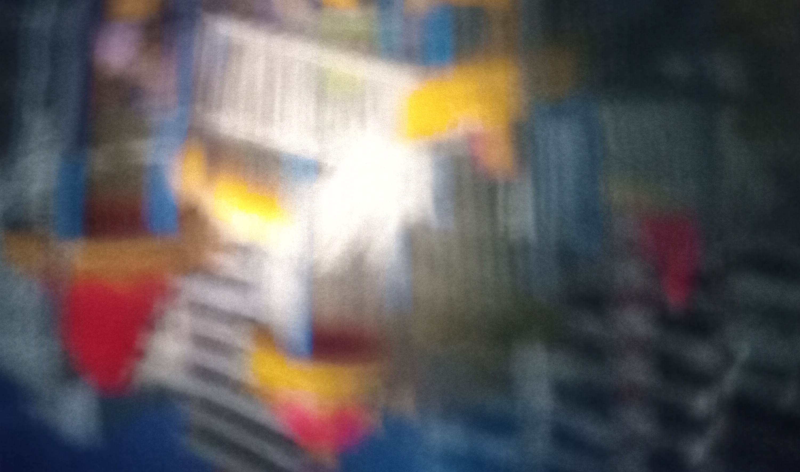

**Idea central:** la luz viaja en línea recta, atraviesa un orificio pequeño y proyecta una imagen invertida sobre un plano interno.

**Conceptos vistos**

- Propagación rectilínea de la luz.
- Proyección invertida.
- Plano de imagen.
- Apertura grande: más luz, menos nitidez.
- Apertura pequeña: más nitidez, menos luminosidad y posible difracción.

---

## 2. Cámara oscura + ecualización HSV

| Original | V ecualizado | Histograma |
| --- | --- | --- |
|  | 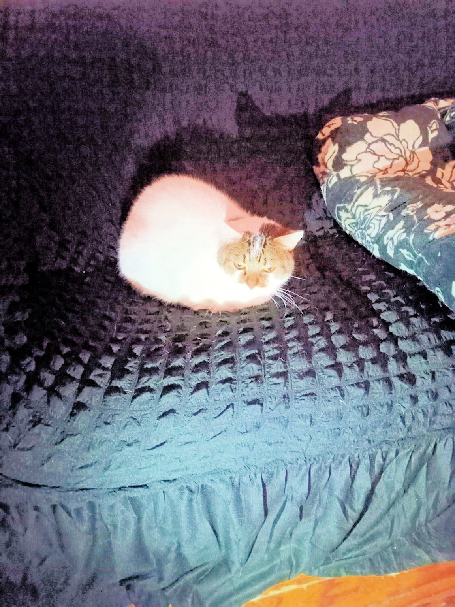 | 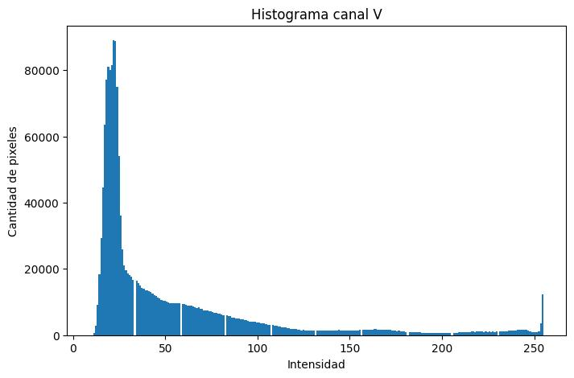 |

**Proceso técnico:** RGB → HSV → separar H, S y V → ecualizar solo V → recomponer RGB.

**Preguntas de la consigna**

- **¿Qué mejoró?** Contraste, separación tonal y visibilidad de formas.
- **¿Qué se perdió?** Naturalidad en algunas transiciones; no se recupera detalle que la captura no registró.
- **¿Qué limitaciones tiene la cámara oscura?** Baja nitidez, ruido, desenfoque óptico y rango dinámico reducido.
- **¿Por qué V y no RGB?** Porque V modifica brillo/contraste con menor riesgo de deformar colores.

---

## 3. Simplicidad visual

| Comparación | Final en grises |
| --- | --- |
| 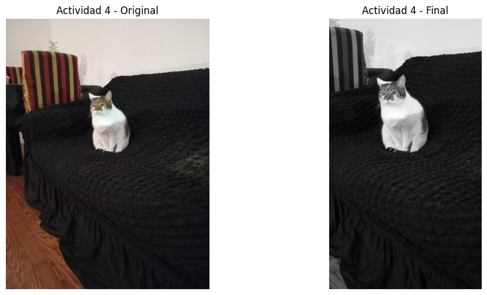 | 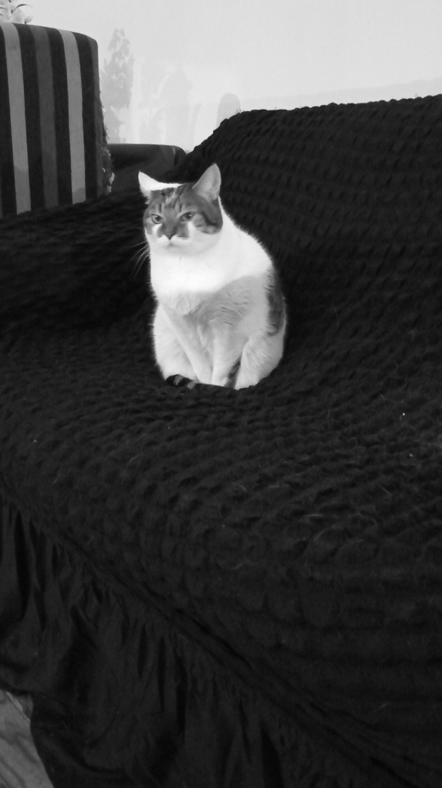 |

**Decisión compositiva:** acercamiento, recorte y escala de grises para que el sujeto principal sea claro.

**Respuestas**

- Distraían la silla, el piso, la mesa y objetos del fondo.
- Se eliminó gran parte del entorno mediante crop.
- En escala de grises la lectura se vuelve más gráfica: pesan más forma, contraste, textura y volumen.

---

## 4. Reencuadre y reinterpretación

| Imagen amplia con marcas | Crop A | Crop B |
| --- | --- | --- |
| 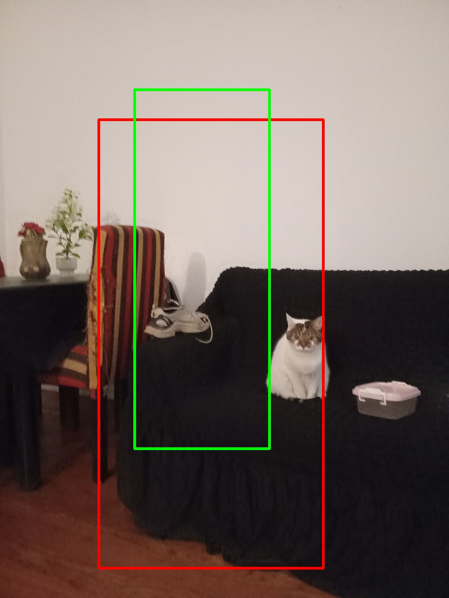 | 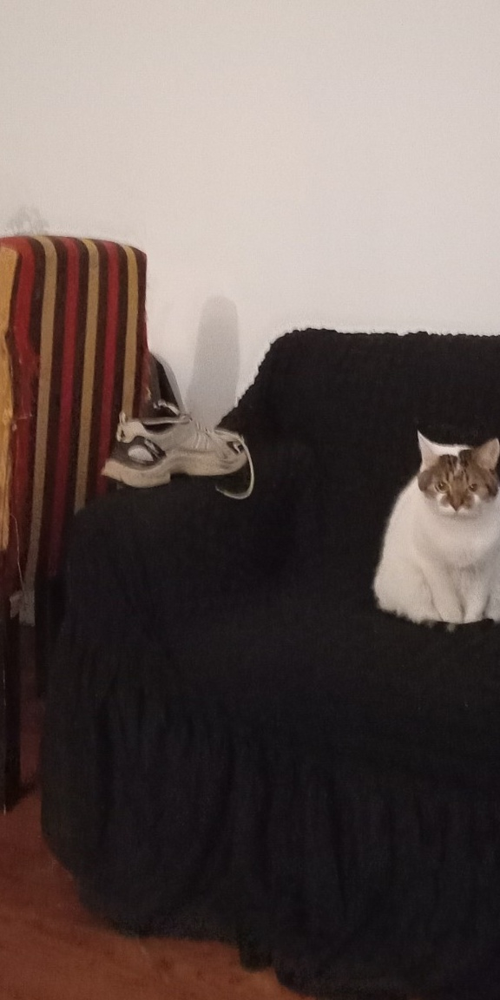 | 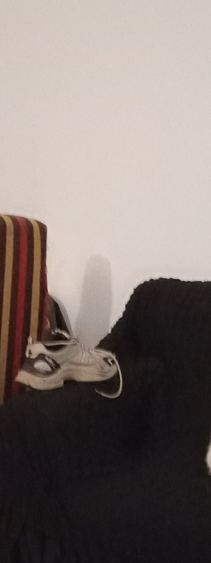 |

**Idea:** cambiar el encuadre cambia el significado.

- Después del crop importan más el rostro, la postura y la dirección de la mirada.
- Desaparecen contexto espacial y objetos secundarios.
- El sujeto pasa de integrar una escena a ser foco absoluto.
- El recorte cerrado vuelve la imagen más íntima y abstracta.

---

## 5. Punto de vista y construcción narrativa

| Comparación de puntos de vista | Imagen final elegida |
| --- | --- |
| 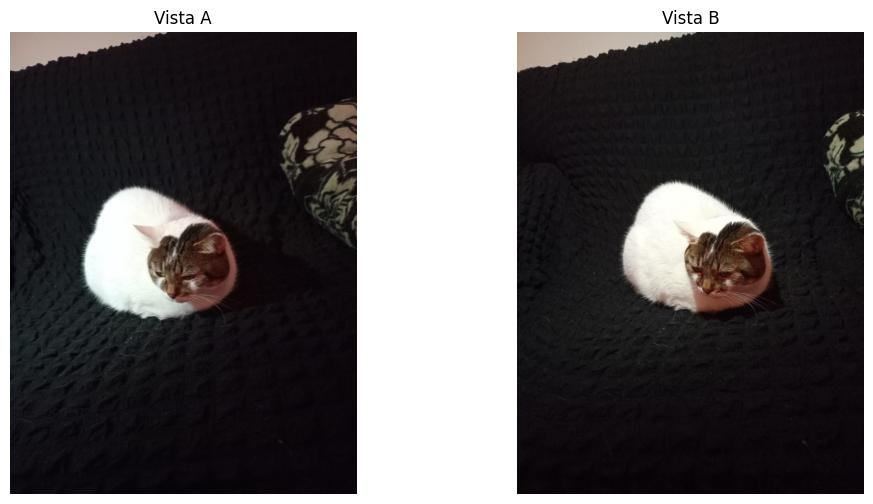 | 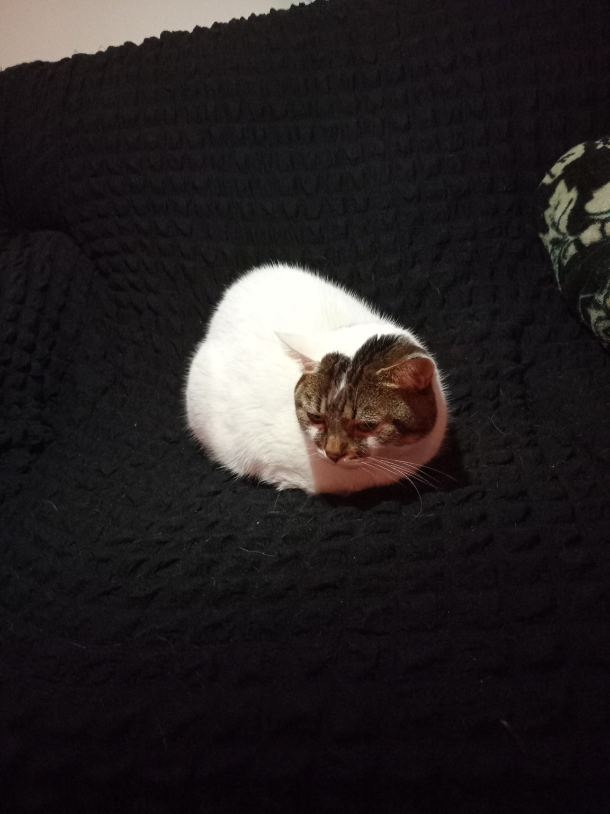 |

**Lectura visual**

- La vista frontal genera cercanía e igualdad visual.
- La vista cenital aporta información del cuerpo y su relación con el sillón.
- El nuevo ángulo cambia la percepción: el sujeto parece más pequeño, aislado y observado desde afuera.
- La cámara no solo muestra la escena: también la interpreta.

---

## 6. Fotografía basada en la luz

| Fotografía final | Comparación |
| --- | --- |
|  | 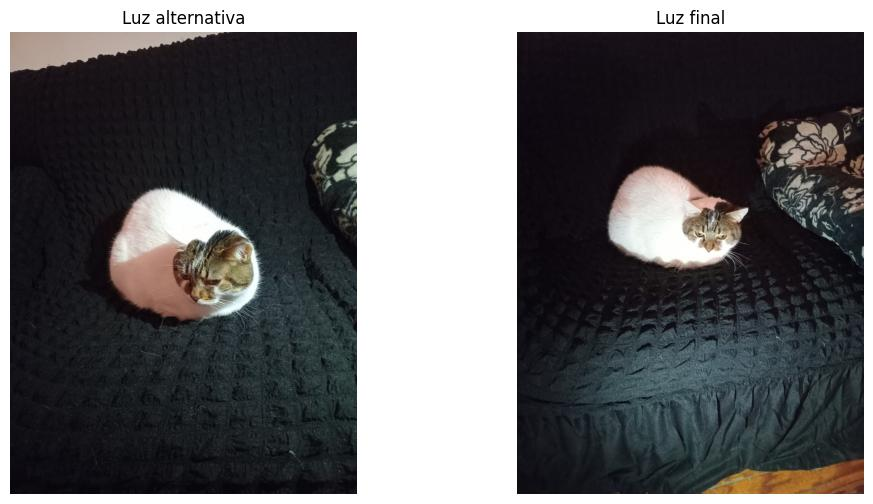 |

**Esquema:** luz lateral → sujeto → sombra.

**Respuestas**

- La luz revela volumen y textura en manta y pelaje.
- También esconde parte del entorno, simplificando la escena.
- El contraste lateral aumenta la sensación tridimensional.
- La atmósfera se vuelve más introspectiva y dramática.

---

## 7. Selección crítica

| Pruebas y descartes | Imagen elegida |
| --- | --- |
| 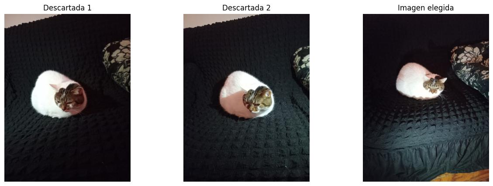 |  |

**Criterio de selección**

La imagen elegida funciona mejor porque tiene intención visual clara, contraste fuerte y buena separación entre sujeto y fondo.

**Problemas de las descartadas**

- Exceso de espacio vacío.
- Iluminación menos controlada.
- Menor impacto visual.
- Narrativa menos clara.

---

## 8. Reflexión final

**¿Qué aprendí sobre mirar?**  
Mirar no es solo reconocer objetos: es observar relaciones entre luz, forma, fondo, encuadre e intención.

**¿Registrar o construir?**  
Registrar captura una escena. Construir implica decidir qué entra, qué sale, desde dónde se mira y cómo se ordena la atención.

**Óptica, percepción y composición**  
La óptica condiciona la captura; la percepción organiza lo visible; la composición dirige la lectura.

**Postproceso**  
No reemplaza a la captura: enfatiza contraste, simplifica información y modifica la lectura de la fotografía.

---

## 9. Anexo técnico mínimo


```text
img = leer_imagen()
hsv = RGB_a_HSV(img)
H, S, V = separar_canales(hsv)
V_eq = ecualizar_histograma(V)
final = HSV_a_RGB(H, S, V_eq)
grises = convertir_a_escala_de_grises(img)
```

**Operaciones incluidas**

- Conversión RGB ↔ HSV.
- Ecualización del canal V.
- Conversión a escala de grises.
- Recorte digital.
- Análisis de histogramas.

